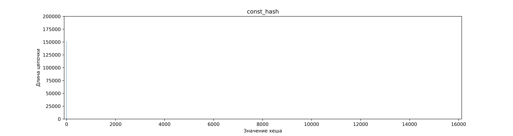
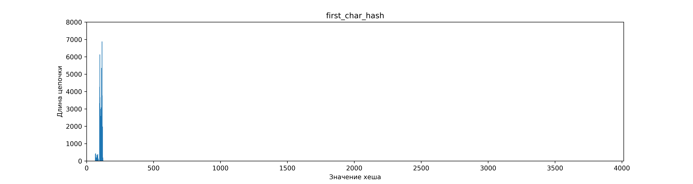
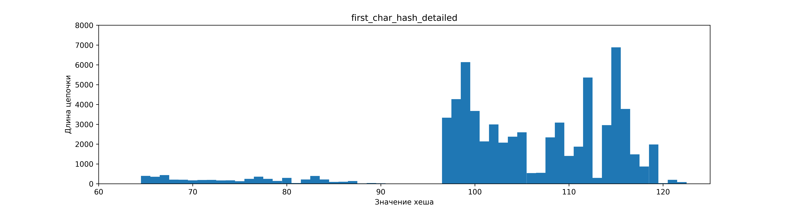
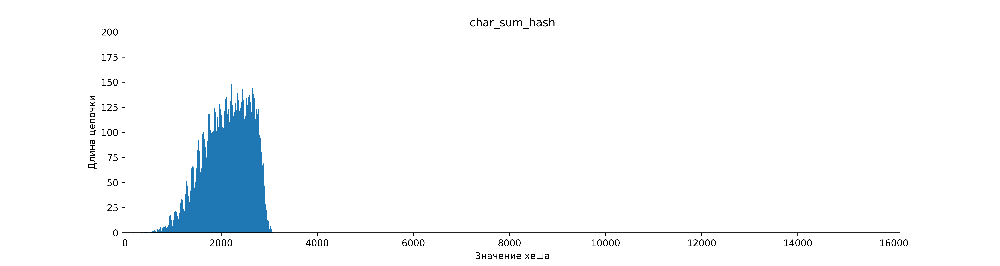
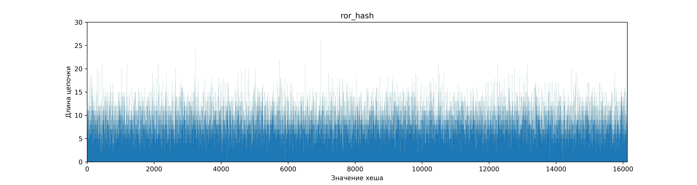
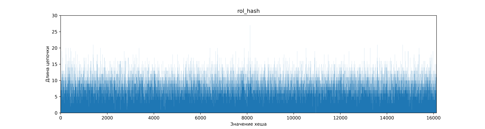
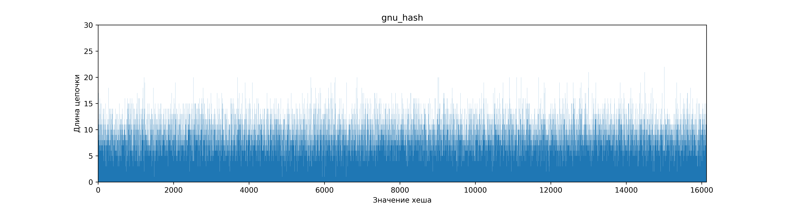
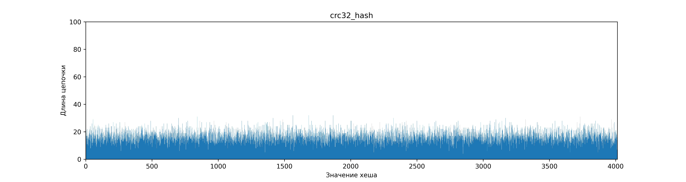
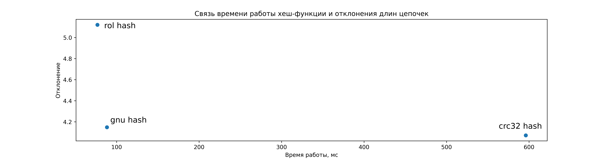

# Изучение и оптимизация хeш-таблиц
## Цель работы
В данной работе будут рассматриваться различные подходы к оптимизациям хеш-таблиц. Для начала мы рассмотрим различные хеш-функции, сравнивая два параметра - скорость вычисления хеша и равномерность распределения данных по значениям хеша. После этого выберем функцию с наилучшими параметрами и рассмотрим возможные оптимизации функции поиска при помощи использования ассемблера и SIMD инструкций.

Подразумевается, что читатель знаком с понятиями хеш-таблицы, хеш-функции, коллизий, заселенности хеш таблицы и способом разрешения коллизий методом цепочек.

## Зафиксированные на протяжении выполнения работы параметры

Для работы был использован англо-русский словарь на $76000$ пар слово-перевод, из которых уникальными являются $69000.$ В качестве ключа использовалось английское слово, в качестве значения - перевод слова на русский. Размер таблицы фиксирован на протяжении всего исследования и равен простому числу $4013.$ Для такого размера средняя длина цепочки составляет $17$ пар ключ-значение. При попытке добавить пару с существующим в таблице ключом новое значение игнорируется.

Для вычисления и хранения значения хешей будем использовать переменную типа `uint32_t`, рассматривая значения по модулю размера хеш-таблицы. Под размером хеш-таблицы подразумевается количество цепочек, включая пустые.

**Замечание:** Измерения, которые будут получены в ходе работы, специфичны для конкретного словаря и конкретного размера таблицы. В силу этого полученные результаты применимы исключительно для используемых входных параметров.

## Часть 1. Изучение и сравнение хеш-функций.

В данном разделе мы сравним различные хеш-функции. Для сравнения будут использоваться:
* `const hash` - хеш-функция, принимающая значение $1$ для любого ключа. Используется для иллюстрации плохой хеш-функции. 
* `first char hash` - значение хеш-функции равно ASCII-коду первого символа ключа.
* `char sum hash` - значение хеш-функции равно сумме ASCII-кодов всех символов ключа.
* `ror hash`, `rol hash` - значение хеш-функции вычисляется в цикле по символам ключа, где на каждом шаге производятся операции циклического сдвига вправо и влево соответственно, и прибавление к хешу ASCII-кода символа.
* `gnu hash` - gnu hash в общепринятом его понимании. [[oracle](https://blogs.oracle.com/solaris/post/gnu-hash-elf-sections)]. Используется для иллюстрации хорошей хеш-функции.
* `crc32 hash` - CRC32-IEEE 802.3 хеш с использованием полинома 0x82608EDB. [[wikipedia](https://ru.wikipedia.org/wiki/%D0%A6%D0%B8%D0%BA%D0%BB%D0%B8%D1%87%D0%B5%D1%81%D0%BA%D0%B8%D0%B9_%D0%B8%D0%B7%D0%B1%D1%8B%D1%82%D0%BE%D1%87%D0%BD%D1%8B%D0%B9_%D0%BA%D0%BE%D0%B4)]. Используется для иллюстрации хорошей хеш-функции.

Предположение о "хорошести" последних двух функций основано на общественном мнении, так как математическое доказательство является сложным для первокурсника. В ходе работы мы проверим, что эти функции дают равномерное распределение для наших входных параметров.

### Стресс-тесты

Проверим, что написанные хеш-функции и хеш-таблица работают корректно на нашем словаре. Для этого будем использовать два теста:

* Заполним таблицу данными из словаря. Для всех уникальных ключей выполним функцию поиска и проверим, что значения в таблице и в словаре совпадают.
* Заполним таблицу данными из словаря. Для всех ключей во всех цепочках вычислим значения хеша заново и проверим, что оно совпадает с номером цепочки.

### Распределение ключей по цепочкам
Заполним хеш-таблицу значениями из нашего словаря. Значения хеша для ключа будем рассматривать по модулю размера таблицы. Выведем длины цепочек, соответствующих всем возможным значениям хеша и построим графики распределения пар по цепочкам.

Исходные данные можно посмотреть в [таблице](stat/chains_sizes.csv).

#### `Const hash`
Код функции:
```c++
uint32_t const_hash(const char *key) {
    return 1;
}
```

Предварительный анализ: 
> В случае, когда на любом ключе хеш-функция возвращает одинаковое значение, все пары слов попадают в одну цепочку, сводя таблицу к связному списку.

График распределения выглядит следующим образом:



Среднеквадратичное отклонение длин цепочек от средней длины:

const_hash_deviation $= 1081$

Анализ: 
> Получен единственный столбик длины равной числу пар, что подтверждает предположение. Поиск в таблице сводится к поиску в массиве ключей, что лишает использование хеш-таблицы смысла.

**Вывод:** функция неэффективна для хеширования.

#### `First char hash`
Код функции:
```c++
uint32_t first_char_hash(const char *key) {
    char first_char = *key;
    return first_char;
}
```

Предварительный анализ: 

> Значения ASCII-кода первого символа лежат в диапазоне $[0, 255]$. При этом в качестве ключей используются английские слова, начинающиеся в основном со строчных букв, поэтому хеши ключей будут распределены в диапазоне значений $[97, 122]$. Так же небольшая часть попадет в диапазон заглавных букв: $[65, 90]$. Распределение внутри указанных диапазонов зависит от частот употребления букв в качестве первых в слове и частот написания слов с заглавной или со строчной букв. Обе частоты при этом специфичны для конкретного выбранного словаря, поэтому сделать предположения о распределении слов внутри диапазонов нельзя.

График распределения:



Приблизим и рассмотрим в диапазоне ненулевых значений:



Вычислим среднеквадратичное отклонение длин цепочек:

first_char_deviation $= 244$

Анализ: 
> Пары действительно попали в указанные диапазоны. В силу того, что диапазоны возможных значений фиксированы, функция плоха для таблиц большого размера. Дополнительно, средняя длина цепочки меньше среднеквадратичного отклонения, что говорит о неравномерности.

**Вывод:** функция неэффективна на больших таблицах.

#### `Char sum hash`
Код функции:
```c++
uint32_t char_sum_hash(const char *key) {
    uint32_t sum = 0;
    char symbol = *key;

    while (symbol != 0) {
        sum += symbol;
        ++key;
        symbol = *key;
    }

    return sum;
}
```

Предварительный анализ:
Заметим, что диапазон ASCII кодов букв в несколько раз меньше самих ASCII кодов.

> Диапазон значений для одной буквы равен $25$, что в несколько раз меньше значений из диапазона. Таким образом изменения значений буквы в рамках слов одной длины в среднем будет давать меньшее изменение хеша, чем изменение длины слова. Таким образом можно предположить группировку значений хешей вблизи пиков, соответствующих средним хешам слов различных длин. При этом в нашем случае длина ключа не превышает $32$ символа, а ASCII-коды английского алфавита не превышают $125$. Это означает, что значение хеша никогда не превысит $4000$.

График распределения пар по хешам:


Среднеквадратичное отклонение длин цепочек:

char_sum_hash_deviation $= 25$

Анализ: 
> Пики действительно наблюдаются, что говорит о неравномерности распределения значений хеш-функции. Заметим, что ни один элемент не имеет хеш, больший 4000, что согласуется с оценкой сверху. В силу этого, количество занятых цепочек не увеличивается с увеличением размера хеш-таблицы, что тоже является минусом данной хеш-функции. Отклонение превышает среднюю длину, что говорит о сильной неравномерности.

**Вывод:** функция неэффективна.

#### `Ror hash`
Код функции:
```c++
static uint32_t ror(uint32_t val) {
    uint32_t new_val = (val >> 1) | (val << 31);
    return new_val;
}

uint32_t ror_hash(const char *key) {
    assert(key);
    uint32_t hash = 0;
    char sym = *key;

    while (sym != 0) {
        hash = ror(hash) + sym;
        ++key;
        sym = *key;
    }

    return hash;
}
```

Предварительный анализ:
> Функция способна покрывать весь диапазон возможных значений переменной типа `uint32_t`. Действительно, переменная данного типа содержит $32$ бита. Поскольку все ключи состоят из букв английского алфавита, уже изначально будет задействовано 6 бит. При этом на каждом шаге все биты сдвигаются вправо, что значит, что за $26$ итераций все биты хеша будут задействованы. Для рассматриваемой хеш-таблицы достаточно 6 итераций для достижения максимального значения хеша. Поскольку прибавление нового элемента на последних шагах изменяет хеш слабее, чем сдвиг, есть основания предполагать, что слова с похожим началом будут находиться рядом. На коротких словах (до достижения старшего бита) так же будет зависимость от длины слова. 
>
> Резюмируем: должна заполниться вся таблица, но распределение будет иметь пики.

График распределения:



Среднеквадратичное отклонение длин цепочек:

ror_hash_deviation $= 13$

Анализ:
> Как и ожидалось, все возможные значения хеш-функции достигаются. Пики присутствуют, и увеличивают среднеквадратичное отклонение. Значение отклонения незначительно меньше длин цепочек, что говорит о плохой применимости.

**Вывод:** хеш-функция неэффективна.

#### `Rol hash`
Код функции:
```c++
static uint32_t rol(uint32_t val) {
    uint32_t new_val = (val << 1) | (val >> SHIFT);
    return new_val;
}

uint32_t rol_hash(const char *key) {
    uint32_t hash = 0;
    char sym = *key;

    while (sym != 0) {
        hash = rol(hash) + sym;
        ++key;
        sym = *key;
    }

    return hash;
}
```

Предварительный анализ:
> Функция способна покрывать все значения хешей в таблице. Действительно, уже при первых сдвигах мы начинаем занимать старшие биты переменной, содержащей хеш. При этом за счет суммирования младшие биты постоянно обновляются, и на последующих шагах обновляют старшие. Таким образом любой добавленный или измененный символ значительно влияет на значение хеша, а значит хеши для близких слов сильно отличаются. Это позволяет предположить распределение, покрывающее весь диапазон возможных значений хеша.

График распределения:



Среднеквадратичное отклонение длин цепочек:

rol_hash_deviation $= 5$

Анализ: 
> Заметных пиков не наблюдается, ключи распределены по всей таблице. При средней длине цепочки в 17 символов наблюдается разброс значений в 5 элементов. Таким образом функция действительно дает хорошее распределение.

**Вывод:** хеш-функция подходит для использования в данной задаче.

#### `GNU hash`
Код функции:
```c++
uint32_t gnu_hash(const char *key) {
    uint32_t hash = 5381;
    char sym = *key;

    while (sym != 0) {
        hash = ((hash << 5) + hash) + sym;
        ++key;
        sym = *key;
    }

    return hash;
}
```

Предположение:
> При помощи использования данной функции хеширования и за счет выбранных констант 5381 и 33 можно добиться равномерного распределения по всему диапазону. [про работу gnu hash - [oracle](https://blogs.oracle.com/solaris/post/gnu-hash-elf-sections)].

График распределения:



Среднеквадратичное отклонение длин цепочек:

gnu_hash_deviation $= 4$

Анализ: 
> Равномерное покрытие всего диапазона возможных хешей действительно наблюдается. Отклонение равно 4 элементам при средней длине цепочки в 17 элементов, что говорит о равномерности полученного распределения.

**Вывод:** хеш-функция применима.

#### `CRC32 hash`
Код функции:
```c++
uint32_t crc32_hash(const char *key) {
    unsigned char sym = *key;
    unsigned int  crc = 0xFFFFFFFF; 
    unsigned int mask = 0;

    while (sym != 0) {
        crc = crc ^ sym;

        for (int j = 7; j >= 0; j--) {
            mask = -(crc & 1);
            crc = (crc >> 1) ^ (CRC32_CONST & mask);
        }

        ++key;
        sym = *key;
    }

    return ~crc;
}
```

Предположение: 
> За счет использования выбранного полинома можно добиться равномерного распределения по всему диапазону возможных значений. [про работу crc32 hash - [wikipedia](https://ru.wikipedia.org/wiki/%D0%A6%D0%B8%D0%BA%D0%BB%D0%B8%D1%87%D0%B5%D1%81%D0%BA%D0%B8%D0%B9_%D0%B8%D0%B7%D0%B1%D1%8B%D1%82%D0%BE%D1%87%D0%BD%D1%8B%D0%B9_%D0%BA%D0%BE%D0%B4)]

График распределения:



Среднеквадратичное отклонение длин цепочек:

crc32_hash_deviation $= 4$

Анализ:
> Равномерное покрытие всего диапазона возможных хешей действительно наблюдается. При средней длине цепочки в 17 элементов, отклонение в 4 элемента является небольшим и свидетельствует о равномерности распределения.

**Вывод:** хеш-функция применима.

### Время работы хеш-функций

Для измерения времени работы вычислим значения хешей для всех ключей 100 раз. Исходные данные можно посмотреть в [таблице](stat/hash_times.csv). Приведем значения, усредненные по 3 запускам и округленные по стандартным правилам:

$t_{ср}$ - среднее время вычисления хеша для всех ключей выполненного 100 раз, усредненное по 3 измерениям

$\Delta t$ - среднеквадратичное отклонение результатов измерений

|     функция    | $t_{ср}$, msec | $\Delta t$, msec |
|----------------|----------------|------------------|
|const           | 9.13           | 0.09             |
|first_char_hash | 9.31           | 0.09             |
|char_sum_hash   | 75.7           | 1.7              |
|ror_hash        | 90             | 2                |
|rol_hash        | 75.7           | 1.6              |
|gnu_hash        | 88.3           | 1.8              |
|crc32_hash      | 596            | 6                |

### Сравнение функций

Сравнивать будем только функции, дающие эффективное распределение. Построим диаграмму, отражающую отклонения и времена работы хеш-функций:



Мы видим, что все три функции имеют свои плюсы: `rol hash` самая быстрая, `crc32 hash` имеет лучшее распределение, а `gnu_hash` является медианным алгоритмом, сочетая преимущества и недостатки обоих алгоритмов.

**Вывод:** все три функции применимы в текущей задаче. Для дальнейших оптимизаций выберем `crc32 hash` в силу наличия векторной реализации. В ходе оптимизаций мы покажем, что её ускоренная версия опережает `gnu hash` и `rol hash`.

## Оптимизация
