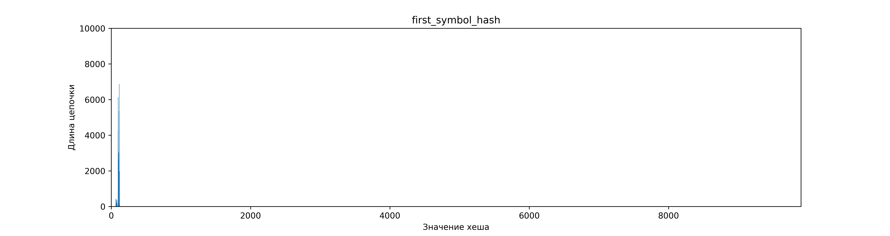
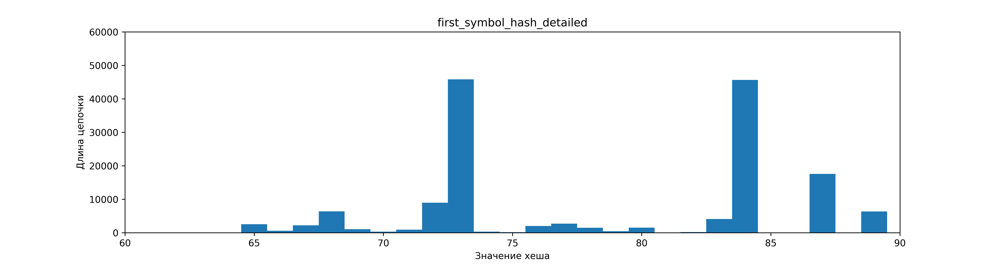

# Изучение и оптимизация хeш-таблиц
В данной работе будут рассматриваться различные подходы к оптимизациям хеш-таблиц. Для начала мы рассмотрим различные хеш-функции, сравнивая два параметра - скорость вычисления хеша и равномерность распределения данных по значениям хеша. После этого выберем функцию с наилучшими параметрами и рассмотрим оптимизации функции поиска.

Разрешение коллизий в хеш-таблице будет происходить методом цепочек.

Для работы был использован англо-русский словарь на $75826$ пар слово-перевод, из которых уникальными являются $68501$. В качестве ключа использовалось английское слово, в качестве значения - перевод слова на русский. Размер таблицы фиксирован на протяжении всего исследования и равен простому числу $4013$. Для такого размера средняя длина цепочки составляет $17$ пар ключ-значение. При попытке добавить пару с существующим в таблице ключом новое значение игнорируется.

Номер цепочки, в который производится вставка, определяется как hash(key) % hashmap_size, где hashmap_size — количество цепочек.

## Хеш-функции
В данном разделе мы сравним различные хеш-функции. Для сравнения будут использоваться:
* `const hash` - хеш-функция, принимающая значение $1$ для любого ключа.
* `first symbol hash` - значение хеш-функции равно ASCII-коду первого символа ключа.
* `char sum hash` - значение хеш-функции равно сумме ASCII-кодов всех символов ключа.
* `ror hash`, `rol hash` - значение хеш-функции вычисляется в цикле по символам ключа, где на каждом шаге производятся операции циклического сдвига вправо и влево соответственно, и прибавление к хешу ASCII-кода символа.
* `gnu hash` - gnu hash в общепринятом его понимании [[1](#ссылки)].
* `crc32 hash` - CRC32-IEEE 802.3 хеш с использованием полинома 0x82608EDB [[2](#ссылки)]

Для вычисления и хранения значения хешей будем использовать переменную типа `uint32_t`, рассматривая значения по модулю размера хеш-таблицы.

### Распределение ключей по цепочкам и время работы
Заполним хеш-таблицу значениями из нашего словаря, избегая повторов ключей. Значения хеша для ключа будем рассматривать по модулю размера таблицы. Выведем длины цепочек, соответствующих всем возможным значениям хеша и построим графики распределения пар по цепочкам.

Исходные данные можно посмотреть в [таблице](stat/chains_sizes.csv).

#### `Const hash`

Предварительный анализ: 
> В случае, когда на любом ключе хеш-функция возвращает значение 1, все пары слов попадают в одну цепочку, вырождая таблицу в список.

График распределения выглядит следующим образом:

Среднеквадратичное отклонение длин цепочек от средней длины:

const_hash_deviation $= 1081$

Анализ: 
> Получен единственный столбик длины равной числу пар, что подтверждает предположение. Поиск в таблице сводится к поиску в массиве ключей, что лишает использование хеш-таблицы смысла.

Вывод: функция неэффективна для хеширования.

#### `First symbol hash`

Предварительный анализ: 

> Значения ASCII-кода первого символа лежат в диапазоне $[0, 255]$. При этом в качестве ключей используются английские слова, начинающиеся в основном со строчных букв, поэтому пары будут распределены в диапазоне значений, соответствующих строчным английским буквам: $[97, 122]$. Так же небольшая часть попадет в диапазон заглавных букв: $[65, 90]$. Распределение внутри указанных диапазонов зависит от частот употребления букв в качестве первых в слове и частот написания слов с заглавной и со строчной букв. Обе частоты при этом специфичны для конкретного выбранного словаря, поэтому сделать предположения о распределении слов внутри диапазонов нельзя.

График распределения:

Приблизим и рассмотрим в диапазоне ненулевых значений:

Вычислим среднеквадратичное отклонение длин цепочек от средней длины:

first_char_deviation $= 244$

Анализ: 
> Пары действительно попали в указанные диапазоны. В силу того, что диапазоны возможных значений фиксированы, функция плоха для таблиц большого размера. Дополнительно, средняя длина цепочки меньше среднеквадратичного отклонения, что говорит о неравномерности.

Вывод: функция неэффективна на больших таблицах.

#### `Char sum hash`

Предварительный анализ:
> Диапазон значений для одной буквы равен $25$, что в несколько раз меньше значений из диапазона. Таким образом изменения значений буквы в рамках слов одной длины в среднем будет давать меньшее изменение хеша, чем изменение длины слова. Таким образом можно предположить группировку значений хешей вблизи пиков, соответствующих средним хешам слов различных длин. При этом в нашем случае длина ключа не превышает $32$ символа, а ASCII-коды символов не превышают ASCII-код буквы `z`, равный $125$. Это означает, что значение хеша никогда не превысит 4000.

График распределения пар по хешам:

Вычислим среднеквадратичное отклонение длин цепочек от средней длины:

char_sum_hash_deviation $= 25$

Анализ: 
> Пики действительно наблюдаются, и говорят о неравномерности распределения. Цепочки перестают иметь элементы для номера, меньшего чем 4000, так как это значение было оценкой сверху. С ростом значения хеша уменьшается длина цепочки. Таким образом хеш зависим от длины слова, что дает плохую результативность. Так же минусом является то, что увеличение размеров таблицы не уменьшает длины цепочек в силу того, что конец таблицы никогда не будет достигаться. Длины разбросаны от меньших, чем отклонение, до превышающих его в разы, что говорит о сильной неравномерности.

Вывод: функция неэффективна.

#### `Ror hash`

Предварительный анализ:
> Функция способна покрывать весь диапазон возможных значений переменной типа `uint32_t`. Действительно, переменная данного типа содержит $32$ бита. Мы используем ключи, состоящие из английских букв, что значит, что изначально мы прибавим к переменной значение, занимающее $6$ бит, старший из них ненулевой. При этом на каждом шаге самый правый бит сдвигается на $1$ вправо, что значит, что за $26$ шагов мы гарантированно дойдем до старшего бита всей переменной. В случае нашего размера таблицы достаточно 6 шагов для превышения хешем максимального значения. Однако из-за битовых сдвигов есть основания предполагать, что слова с похожим началом будут находиться рядом, так как прибавление нового элемента на последних шагах изменяет хеш слабее, чем сдвиг. На коротких словах (до достижения старшего бита) так же будет зависимость от длины слова. 
>
> Резюмируем: должна заполниться вся таблица, но распределение будет иметь пики.

График распределения:

Среднеквадратичное отклонение длин цепочек от среднего значения:

ror_hash_deviation $= 13$

Анализ:
> Функция действительно лишена недостатка неспособности покрывать не все значения диапазона на таблице нашего размера. Пики присутствуют, и увеличивают значение среднеквадратичного отклонения. Значение отклонения незначительно меньше длин цепочек, что говорит о плохой применимости.

Вывод: хеш-функция неэффективна.

#### `Rol hash`

Предварительный анализ:
> Функция способна покрывать все значения хешей в таблице. Действительно, уже при первых сдвигах мы начинаем занимать старшие биты переменной, содержащей хеш. При этом за счет суммирования младшие биты постоянно обновляются, и на последующих шагах обновляют старшие. Таким образом любой добавленный или измененный символ значительно влияет на значение хеша, хеши для близких слов сильно отличаются. Это позволяет предположить близкое к равномерному распределение, покрывающее весь диапазон возможных значений хеша.

График распределения:

Среднеквадратичное отклонение от средней длины цепочки:

rol_hash_deviation $= 5$

Вывод: 
> Заметных пиков не наблюдается, пары распределены по всему размеру таблицы. При средней длине цепочки в 17 символов наблюдается разброс значений в 5 элементов. Таким образом функция действительно дает хорошее распределение.

Вывод: хеш-функция применима.

#### `GNU hash`

Предположение:
> При помощи использования данной функции хеширования и за счет выбранных констант можно добиться равномерного распределения по всему диапазону. [[1](#ссылки)]

График распределения:

Среднеквадратичное отклонение от средней длины цепочки:

gnu_hash_deviation $= 4$

Анализ: равномерное покрытие всего диапазона возможных хешей действительно наблюдается. Отклонение равно 4 элементам при средней длине цепочки, равной 17, что говорит о том, что размер цепочек превышает отклонение в несколько раз. Таким образом функция дает хорошее распределение.

Вывод: хеш-функция применима.

#### `CRC32 hash`

Предположение: 
> За счет использования выбранного полинома можно добиться равномерного распределения по всему диапазону возможных значений. [[2](#ссылки)]

График распределения:

Среднеквадратичное отклонение длины цепочки от среднего значения:

crc32_hash_deviation $= 4$

Анализ: 
> Равномерное покрытие всего диапазона возможных хешей действительно наблюдается. При средней длине цепочки в 17 элементов, отклонение в 4 элемента является небольшим и говорит о равномерности распределения.

Вывод: хеш-функция применима.

### Время вычисления значения хеша

Для вычисления времени работы вычислим значения хешей для всех ключей 100 раз. Усредним время по 3 измерениям. Исходные данные можно посмотреть в [таблице](stat/hash_times.csv.csv). Приведем усредненные значения, округленные по стандартным правилам:

$t_{ср}$ - среднее время вычисления хеша для всех ключей выполненного 10 раз, усредненное по 3 измерениям

$\Delta t$ - среднеквадратичное отклонение результатов измерений от $t_{ср}$

|     функция    | $t_{ср}$, msec | $\Delta t$, msec |
|----------------|----------------|------------------|
|const           | 9.13           | 0.09             |
|first_char_hash | 9.31           | 0.09             |
|char_sum_hash   | 75.7           | 1.7              |
|ror_hash        | 90.3           | 2                |
|rol_hash        | 75.7           | 1.6              |
|gnu_hash        | 88.3           | 1.8              |
|crc32_hash      | 596            | 6                |

### Сравнение функций

При сравнении функций нас будут интересовать только эффективные с точки зрения распределения функции. Отметим на графике связь среднеквадратичного отклонения длин цепочек от средней длины и время вычисления хеша:

Мы видим, что все три функции имеют свои преимущества: `rol hash` самая быстрая, `crc32 hash` самая равномерная, а `gnu_hash` на втором месте по обоим параметрам, обходя третью позицию с большим отрывом. 

Вывод: все три функции достаточно хороши для использования. Для дальнейших оптимизаций выберем `crc32 hash` в силу удобства векторизации. В ходе оптимизаций мы покажем, что её ускоренная версия опережает `gnu hash` и `rol hash`.

## Оптимизация

## Ссылки

[1] - https://blogs.oracle.com/solaris/post/gnu-hash-elf-sections

[2] - https://ru.wikipedia.org/wiki/%D0%A6%D0%B8%D0%BA%D0%BB%D0%B8%D1%87%D0%B5%D1%81%D0%BA%D0%B8%D0%B9_%D0%B8%D0%B7%D0%B1%D1%8B%D1%82%D0%BE%D1%87%D0%BD%D1%8B%D0%B9_%D0%BA%D0%BE%D0%B4