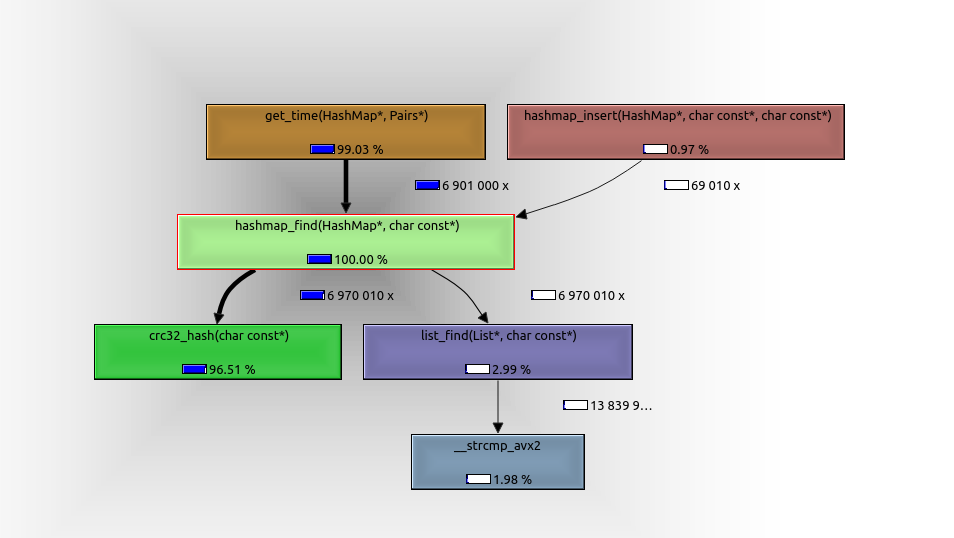

# Изучение и оптимизация хeш-таблиц
## Цель работы
В данной работе будут рассматриваться различные подходы к оптимизациям хеш-таблиц. Для начала мы рассмотрим различные хеш-функции, сравнивая два параметра - скорость вычисления хеша и равномерность распределения данных по значениям хеша. После этого выберем функцию с наилучшими параметрами и рассмотрим возможные оптимизации функции поиска при помощи использования ассемблера и SIMD инструкций.

Подразумевается, что читатель знаком с понятиями хеш-таблицы, хеш-функции, коллизий, заселенности хеш таблицы и способом разрешения коллизий методом цепочек.

## Зафиксированные на протяжении выполнения работы параметры

Для работы был использован англо-русский словарь на $76000$ пар слово-перевод, из которых уникальными являются $69000.$ В качестве ключа использовалось английское слово, в качестве значения - перевод слова на русский. Размер таблицы фиксирован на протяжении всего исследования и равен простому числу $4013.$ Для такого размера средняя длина цепочки составляет $17$ пар ключ-значение. При попытке добавить пару с существующим в таблице ключом новое значение игнорируется.

Для вычисления и хранения значения хешей будем использовать переменную типа `uint32_t`, рассматривая значения по модулю размера хеш-таблицы. Под размером хеш-таблицы подразумевается количество цепочек, включая пустые.

Длина строки, являющейся ключом, никогда не превышает $31$ символ. При этом формат входного файла таков, что на ключ всегда отводится $32$ байта, не занятые символами ключа байты являются нулевыми. Разделителем между строкой-переводом и следующим ключом так же является нулевой байт. Таким образом все строки изначально нуль-терминированы.

**Замечание:** Измерения, которые будут получены в ходе работы, специфичны для конкретного словаря и конкретного размера таблицы. В силу этого полученные результаты применимы исключительно для используемых входных параметров.

## Часть 1. Изучение и сравнение хеш-функций.

В данном разделе мы сравним различные хеш-функции. Для сравнения будут использоваться:
* `const hash` - хеш-функция, принимающая значение $1$ для любого ключа. Используется для иллюстрации плохой хеш-функции. 
* `first char hash` - значение хеш-функции равно ASCII-коду первого символа ключа.
* `char sum hash` - значение хеш-функции равно сумме ASCII-кодов всех символов ключа.
* `ror hash`, `rol hash` - значение хеш-функции вычисляется в цикле по символам ключа, где на каждом шаге производятся операции циклического сдвига вправо и влево соответственно, и прибавление к хешу ASCII-кода символа.
* `gnu hash` - gnu hash в общепринятом его понимании. [[oracle](https://blogs.oracle.com/solaris/post/gnu-hash-elf-sections)] [[strange adventurer](https://thestrangeadventurer.com/hesh-funkciya-djb2/)]. Используется для иллюстрации хорошей хеш-функции.
* `crc32 hash` - CRC32-IEEE 802.3 хеш с использованием полинома 0x04C11DB7. [[wikipedia](https://ru.wikipedia.org/wiki/%D0%A6%D0%B8%D0%BA%D0%BB%D0%B8%D1%87%D0%B5%D1%81%D0%BA%D0%B8%D0%B9_%D0%B8%D0%B7%D0%B1%D1%8B%D1%82%D0%BE%D1%87%D0%BD%D1%8B%D0%B9_%D0%BA%D0%BE%D0%B4)]. Используется для иллюстрации хорошей хеш-функции.

Предположение о "хорошести" последних двух функций основано на общественном мнении, так как математическое доказательство является сложным для первокурсника. В ходе работы мы проверим, что эти функции дают равномерное распределение для наших входных параметров.

### Стресс-тесты

Проверим, что написанные хеш-функции и хеш-таблица работают корректно на нашем словаре. Для этого будем использовать два теста:

* Заполним таблицу данными из словаря. Для всех ключей во всех цепочках вычислим значения хеша заново и проверим, что оно совпадает с номером цепочки. Таким образом проверяется функция вставки (пары вставлены на свои места).
* Заполним таблицу данными из словаря. Для всех уникальных ключей выполним функцию поиска и проверим, что значения в таблице есть для всех ключей, и что они совпадают со значениями в словаре. Таким образом проверяется функции вставки (ни одна пара не потеряна) и поиска (для любого ключа можно найти значение).

Исходный код тестов находится [здесь](test/test.cpp). Проверка при помощи тестов показала, что вставка и поиск работают корректно.

### Распределение ключей по цепочкам
Найдем распределения ключей по цепочкам для всех хеш-функций. Для этого заполним хеш-таблицу значениями из нашего словаря. Выведем длины цепочек, соответствующих всем возможным значениям хеша и построим графики распределения пар по цепочкам.

Исходные данные можно посмотреть в [таблице](stat/chains_sizes.csv).

Исходный код хеш-функций можно посмотреть [здесь](src/hash.cpp). По сравнению с исходным кодом в приведенных ниже фрагмента произведены изменения для удобства чтения: удалены проверки на нулевые указатели, произведены подстановки для `typedef`.

#### `Const hash`
Код функции:
```c++
uint32_t const_hash(const char *key) {
    return 1;
}
```

Предварительный анализ: 
> В случае, когда на любом ключе хеш-функция возвращает одинаковое значение, все пары слов попадают в одну цепочку, сводя таблицу к связному списку.

График распределения выглядит следующим образом:


Размеры цепочек:

| максимальная длина | минимальная длина | среднеквадратичное отклонение по всем цепочкам |
|-|-|-|
| 68501 | 0 | 1081 |

Анализ: 
> Получен единственный столбик длины равной числу пар, что подтверждает предположение. Поиск в таблице сводится к поиску в массиве ключей, что лишает использование хеш-таблицы смысла.

**Вывод:** функция неэффективна для хеширования.

#### `First char hash`
Код функции:
```c++
uint32_t first_char_hash(const char *key) {
    char first_char = *key;
    return first_char;
}
```

Предварительный анализ: 

> Значения ASCII-кода первого символа лежат в диапазоне $[0, 255]$. При этом в качестве ключей используются английские слова, начинающиеся в основном со строчных букв, поэтому хеши ключей будут распределены в диапазоне значений $[97, 122]$. Так же небольшая часть попадет в диапазон заглавных букв: $[65, 90]$. Распределение внутри указанных диапазонов зависит от частот употребления букв в качестве первых в слове и частот написания слов с заглавной или со строчной букв. Обе частоты при этом специфичны для конкретного выбранного словаря, поэтому сделать предположения о распределении слов внутри диапазонов нельзя.

График распределения:


Приблизим и рассмотрим в диапазоне ненулевых значений:


Размеры цепочек:

| максимальная длина | минимальная длина | среднеквадратичное отклонение по всем цепочкам |
|------|---|-----|
| 6881 | 0 | 244 |

Анализ: 
> Пары действительно попали в указанные диапазоны. В силу того, что диапазоны возможных значений фиксированы, функция плоха для таблиц большого размера. Дополнительно, размеры пиков на несколько порядков превышают среднюю длину цепочки, среднеквадратичное отклонение так же заметно больше неё. Таким образом, распределение получается сильно неравномерным.

**Вывод:** функция неэффективна на больших таблицах.

#### `Char sum hash`
Код функции:
```c++
uint32_t char_sum_hash(const char *key) {
    uint32_t sum = 0;
    char symbol = *key;

    while (symbol != 0) {
        sum += symbol;
        ++key;
        symbol = *key;
    }

    return sum;
}
```

Предварительный анализ:
Заметим, что диапазон ASCII кодов букв в несколько раз меньше самих ASCII кодов.

> Диапазон значений для одной буквы равен $25$, что в несколько раз меньше значений из диапазона. Таким образом изменения значений буквы в рамках слов одной длины в среднем будет давать меньшее изменение хеша, чем изменение длины слова. Таким образом можно предположить группировку значений хешей вблизи пиков, соответствующих средним хешам слов различных длин. При этом в нашем случае длина ключа не превышает $32$ символа, а ASCII-коды английского алфавита не превышают $125$. Это означает, что значение хеша никогда не превысит $4000$.

График распределения пар по хешам:


Размеры цепочек:

| максимальная длина | минимальная длина | среднеквадратичное отклонение по всем цепочкам |
|------|---|-----|
| 143  | 0 | 25  |

Анализ: 
> Пики действительно наблюдаются, максимум в разы превышает среднюю длину цепочки, присутствуют цепочки нулевой длины. Это всё говорит о неравномерности распределения значений хеш-функции. Заметим, что ни один элемент не имеет хеш, больший 4000, что согласуется с оценкой сверху. В силу этого, количество занятых цепочек не увеличивается с увеличением размера хеш-таблицы, что тоже является минусом данной хеш-функции. Отклонение превышает среднюю длину, что говорит о сильной неравномерности.

**Вывод:** функция неэффективна.

#### `Ror hash`
Код функции:
```c++
static uint32_t ror(uint32_t val) {
    uint32_t new_val = (val >> 1) | (val << 31);
    return new_val;
}

uint32_t ror_hash(const char *key) {
    assert(key);
    uint32_t hash = 0;
    char sym = *key;

    while (sym != 0) {
        hash = ror(hash) + sym;
        ++key;
        sym = *key;
    }

    return hash;
}
```

Предварительный анализ:
> Функция способна покрывать весь диапазон возможных значений переменной типа `uint32_t`. Действительно, переменная данного типа содержит $32$ бита. Поскольку все ключи состоят из букв английского алфавита, уже изначально будет задействовано 6 бит. При этом на каждом шаге все биты сдвигаются вправо, что значит, что за $26$ итераций все биты хеша будут задействованы. Для рассматриваемой хеш-таблицы достаточно 6 итераций для достижения максимального значения хеша. Поскольку прибавление нового элемента на последних шагах изменяет хеш слабее, чем сдвиг, есть основания предполагать, что слова с похожим началом будут находиться рядом. На коротких словах (до достижения старшего бита) так же будет зависимость от длины слова. 
>
> Резюмируем: должна заполниться вся таблица, но распределение будет иметь пики.

График распределения:


Размеры цепочек:

| максимальная длина | минимальная длина | среднеквадратичное отклонение по всем цепочкам |
|------|---|-----|
| 97   | 0 | 13  |

Анализ:
> Как и ожидалось, все возможные значения хеш-функции достигаются. Пики присутствуют, и увеличивают среднеквадратичное отклонение. Значение отклонения незначительно меньше длин цепочек, наблюдаются пустые цепочки при максимуме, превышающем среднюю длину в несколько раз. Это говорит неравномерности, а значит и о плохой применимости.

**Вывод:** хеш-функция неэффективна.

#### `Rol hash`
Код функции:
```c++
static uint32_t rol(uint32_t val) {
    uint32_t new_val = (val << 1) | (val >> SHIFT);
    return new_val;
}

uint32_t rol_hash(const char *key) {
    uint32_t hash = 0;
    char sym = *key;

    while (sym != 0) {
        hash = rol(hash) + sym;
        ++key;
        sym = *key;
    }

    return hash;
}
```

Предварительный анализ:
> Функция способна покрывать все значения хешей в таблице. Действительно, уже при первых сдвигах мы начинаем занимать старшие биты переменной, содержащей хеш. При этом за счет суммирования младшие биты постоянно обновляются, и на последующих шагах обновляют старшие. Таким образом любой добавленный или измененный символ значительно влияет на значение хеша, а значит хеши для близких слов сильно отличаются. Это позволяет предположить распределение, покрывающее весь диапазон возможных значений хеша.

График распределения:


Размеры цепочек:

| максимальная длина | минимальная длина | среднеквадратичное отклонение по всем цепочкам |
|------|---|-----|
| 37   | 4 | 5   |

Анализ: 
> Заметных пиков не наблюдается, ключи распределены по всей таблице. При средней длине цепочки в 17 символов наблюдается разброс значений в 5 элементов, максимум превышает среднее менее, чем в 2.5 раза, пустых цепочек нет. Таким образом функция действительно дает хорошее распределение.

**Вывод:** хеш-функция подходит для использования в данной задаче.

#### `GNU hash`
Код функции:
```c++
uint32_t gnu_hash(const char *key) {
    uint32_t hash = 5381;
    char sym = *key;

    while (sym != 0) {
        hash = ((hash << 5) + hash) + sym;
        ++key;
        sym = *key;
    }

    return hash;
}
```

Предположение:
> При помощи использования данной функции хеширования и за счет выбранных констант 5381 и 33 можно добиться равномерного распределения по всему диапазону. [про работу gnu hash - [oracle](https://blogs.oracle.com/solaris/post/gnu-hash-elf-sections)].

График распределения:


Размеры цепочек:

| максимальная длина | минимальная длина | среднеквадратичное отклонение по всем цепочкам |
|------|---|-----|
| 32   | 5 | 4   |

Анализ: 
> Равномерное покрытие всего диапазона возможных хешей действительно наблюдается. Отклонение равно 4 элементам при средней длине цепочки в 17 элементов, без пустых цепочек, длины не превышают 2 средних. Таким образом полученное распределение равномерно.

**Вывод:** хеш-функция применима.

#### `CRC32 hash`
Код функции:
```c++
uint32_t crc32_hash(const char *key) {
    unsigned char sym = *key;
    uint32_t      crc = 0xFFFFFFFF; 
    uint32_t     mask = 0;

    while (sym != 0) {
        crc = crc ^ sym;

        for (int j = 7; j >= 0; j--) {
            mask = -(crc & 1);
            crc = (crc >> 1) ^ (CRC32_CONST & mask);
        }

        ++key;
        sym = *key;
    }

    return ~crc;
}
```

Предположение: 
> За счет использования выбранного полинома можно добиться равномерного распределения по всему диапазону возможных значений. [про работу crc32 hash - [wikipedia](https://ru.wikipedia.org/wiki/%D0%A6%D0%B8%D0%BA%D0%BB%D0%B8%D1%87%D0%B5%D1%81%D0%BA%D0%B8%D0%B9_%D0%B8%D0%B7%D0%B1%D1%8B%D1%82%D0%BE%D1%87%D0%BD%D1%8B%D0%B9_%D0%BA%D0%BE%D0%B4)]

График распределения:


Размеры цепочек:

| максимальная длина | минимальная длина | среднеквадратичное отклонение по всем цепочкам |
|------|---|-----|
| 32   | 4 | 4   |

Анализ:
> Равномерное покрытие всего диапазона возможных хешей действительно наблюдается. При средней длине цепочки в 17 элементов, отклонение в 4 элемента является небольшим. Пустых цепочек нет, длины превосходят среднюю не более, чем в 2 раза. Получаем хорошее равномерное распределение.

**Вывод:** хеш-функция применима.

### Время работы хеш-функций

Для измерения времени работы вычислим значения хешей для всех ключей 100 раз. Исходные данные можно посмотреть в [таблице](stat/hash_times.csv). Приведем значения, усредненные по 3 запускам и округленные по стандартным правилам:

$t_{ср}$ - среднее время вычисления хеша для всех ключей выполненного 100 раз, усредненное по 3 измерениям

$\Delta t$ - среднеквадратичное отклонение результатов измерений

|     функция    | $t_{ср}$, msec | $\Delta t$, msec |
|----------------|----------------|------------------|
|const           | 9.13           | 0.09             |
|first_char_hash | 9.31           | 0.09             |
|char_sum_hash   | 75.7           | 1.7              |
|ror_hash        | 90             | 2                |
|rol_hash        | 75.7           | 1.6              |
|gnu_hash        | 88.3           | 1.8              |
|crc32_hash      | 596            | 6                |

### Сравнение функций

Сравнивать будем только функции, дающие эффективное распределение. Построим диаграмму, отражающую отклонения и времена работы хеш-функций:


Мы видим, что все три функции имеют свои плюсы: `rol hash` самая быстрая, `crc32 hash` имеет лучшее распределение, а `gnu_hash` является медианным алгоритмом, сочетая преимущества и недостатки обоих алгоритмов.

**Вывод:** все три функции применимы в текущей задаче. Наилучшей будем считать функцию `gnu hash` из-за хорошего сочетания преимуществ всех хеш-функций. Для дальнейших оптимизаций выберем `crc32 hash` в силу возможности значительного ускорения при помощи SIMD инструкций. Далее мы покажем, что её ускоренная версия опережает `gnu hash` и `rol hash`.

## Оптимизация

В данном разделе будут рассмотрены оптимизации функции поиска в хеш-таблице. При помощи утилиты valgrind найдем узкие места в производительности и будем их последовательно оптимизировать

### Почему нужно оптимизировать поиск?

Поскольку хеш-таблица используется для быстрого поиска перевода слов, моделировать работу будем следующим стресс тестом: хеш-таблица однократно заполняется, после чего в ней 100 раз последовательно ищутся все ключи из словаря. Также будем измерять время, требующееся на поиск, без учета первоначального заполнения. 

Построим граф вызовов:


Мы видим, что $98\%$ времени работы программы занимает функция поиска в хеш-таблице, а значит её ускорение позволит значительно ускорить программу. Продолжим использовать написанный стресс-тест для оценки качества оптимизаций.

### v0: baseline

Рассмотрим функцию поиска внимательнее:



За $100\%$ всегда будем принимать время работы функции `hashmap_find`, вычисляя процент работы вызываемых функций относительно неё. Измерим время работы самой функции `hashmap_find`. [[данные измерений для всех версий](valgrind/times.csv)].


Время работы $3080 \pm 13$ ms.

Погрешность будем рассчитывать как стандартное отклонение по 5 измерениям.

Наибольшее время занимает вызываемая функция хеширования `crc32_hash`. Займемся её оптимизацией. В процессе оптимизации будем заполнять следующую таблицу:

| оптимизация | время работы функции поиска, ms | улучшение относительно предыдущей версии | улучшение относительно v0 |
|:-: |       :-:      |  :-:            |      :-:       |
| v0 | $3080  \pm 13$ | -               | -              |

### v0.1: Работа с памятью

Убедимся, что нам не требуются улучшения с точки зрения работы с памятью и кешем. Для этого воспользуемся `cachegrind`. Предположение: улучшения не потребуются в силу использования реализации списков на массивах, дружелюбной к кешу. Результат проверки кеша:


Поскольку промаши хеша случаются всего в 6.9% случаях, то оптимизация работы с памятью не требуется.

### v1: Оптимизация хеш-функции

Как было сказано выше, в качестве ключа используются строки размером не более 32 байт. Более того, значение хеша имеет тип `uint32_t`. Поскольку значение хеша имеет тип uint32_t, мы можем воспользоваться SIMD-инструкцией `_mm_crc32_u32` быстрого вычисления хеша. Сравним реализации до и после:

```c++
const uint32_t CRC32_CONST = 0x04C11DB7;

uint32_t crc32_hash(const char *key) {
    unsigned char sym = *key;
    uint32_t      crc = 0xFFFFFFFF; 
    uint32_t     mask = 0;

    while (sym != 0) {
        crc = crc ^ sym;

        for (int j = 7; j >= 0; j--) {
            mask = -(crc & 1);
            crc = (crc >> 1) ^ (CRC32_CONST & mask);
        }

        ++key;
        sym = *key;
    }

    return ~crc;
}
```

```c++
uint32_t crc32_hash(const char *key) {
    uint32_t hash = 0;

    hash = _mm_crc32_u32(hash, *((const uint64_t *)key + 0));
    hash = _mm_crc32_u32(hash, *((const uint64_t *)key + 1));
    hash = _mm_crc32_u32(hash, *((const uint64_t *)key + 2));
    hash = _mm_crc32_u32(hash, *((const uint64_t *)key + 3));

    return hash;
}
```

Как и в приведенных фрагментах кода для хеш-функций в первой части, здесь выполнены подстановки `typedef` и убраны `assert`-ы.

При помощи [godbolt](https://godbolt.org/z/MT75WhrKK) посмотрим на код двух этих функций на ассемблере:

```assembly
crc32_hash(char const*):
        movzx   edx, BYTE PTR [rdi]
        test    dl, dl
        je      .L5
        mov     eax, -1
        jmp     .L4
.L8:
        add     rdi, 1
        movzx   edx, BYTE PTR [rdi]
        test    dl, dl
        je      .L2
.L4:
        movzx   edx, dl
        xor     eax, edx
        mov     edx, 8
.L3:
        mov     ecx, eax
        shr     ecx
        and     eax, 1
        neg     eax
        and     eax, 79764919
        xor     eax, ecx
        sub     edx, 1
        jne     .L3
        jmp     .L8
.L5:
        mov     eax, -1
.L2:
        not     eax
        ret
```

```assembly
crc32_hash(char const*):
    mov     eax, 0
    crc32   eax, DWORD PTR [rdi]
    crc32   eax, DWORD PTR [rdi+8]
    crc32   eax, DWORD PTR [rdi+16]
    crc32   eax, DWORD PTR [rdi+24]
    ret
```

Рассмотрим так же код из Godbolt для версии без интринсиков, собранный с флагом `-Ofast`.

<details>
<summary>Код с развернутым циклом</summary>

```assembly
crc32_hash(char const*):
        movzx   edx, BYTE PTR [rdi]
        mov     rcx, rdi
        test    dl, dl
        je      .L4
        mov     eax, -1
.L3:
        xor     edx, eax
        mov     eax, edx
        and     edx, 1
        neg     edx
        shr     eax
        and     edx, 79764919
        xor     edx, eax
        mov     eax, edx
        and     edx, 1
        neg     edx
        shr     eax
        and     edx, 79764919
        xor     eax, edx
        mov     edx, eax
        and     eax, 1
        neg     eax
        shr     edx
        and     eax, 79764919
        xor     edx, eax
        mov     eax, edx
        and     edx, 1
        neg     edx
        shr     eax
        and     edx, 79764919
        xor     eax, edx
        mov     edx, eax
        and     eax, 1
        neg     eax
        shr     edx
        and     eax, 79764919
        xor     edx, eax
        mov     eax, edx
        and     edx, 1
        neg     edx
        shr     eax
        and     edx, 79764919
        xor     eax, edx
        mov     edx, eax
        shr     edx
        and     eax, 1
        add     rcx, 1
        neg     eax
        and     eax, 79764919
        xor     edx, eax
        mov     eax, edx
        and     edx, 1
        neg     edx
        shr     eax
        and     edx, 79764919
        xor     eax, edx
        movzx   edx, BYTE PTR [rcx]
        test    dl, dl
        jne     .L3
        not     eax
        ret
.L4:
        xor     eax, eax
        ret
```
</details>

Заметим, что даже с `-Ofast` компилятор применяет лишь базовые оптимизации, такие как развертка цикла, но не использует векторную инструкцию crc32. Для флага `-O1` не применяется даже развертка цикла. Таким образом, использование интринсиков, прямо указывающее компилятору использовать векторные инструкции, должно сильно ускорить программу за счет аппаратного ускорения хеширования.

Измерим время работы функции поиска в хеш-таблице после оптимизации хеш-функции и посмотрим на граф вызовов:


Заполняем таблицу:

| оптимизация | время работы функции поиска, ms | улучшение относительно предыдущей версии | улучшение относительно v0 |
|:-: |       :-:      |  :-:            |      :-:       |
| v0 | $3080  \pm 13$ | -               | -              |
| v1 | $247   \pm 7$  | $12.5 \pm 0.4$  | $12.5 \pm 0.4$ |

Мы видим, что хеш-функция теперь занимает $5\%$ времени работы функции поиска вместо $97\%$. При этом вся функция поиска работает $247$ ms вместо $3080$ ms, а значит хеш-функция ускорилась c $3000$ ms до $12$ ms, что является ускорением в $250$ раз.
Таким образом выбор crc32 вместо gnu hash был обоснованным, так как оптимизированная версия crc32 работает быстрее, чем gnu hash, не имеющий аппаратного ускорения.

На графе вызовов видно, что теперь самой затратной по времени является функция поиска в списке, в которой, в свою очередь, больше всего времени требуется на функцию strcmp. Перейдем к её оптимизации.

### v2: strcmp

Для ускорения функции strcmp векторизуем цикл сравнения при помощи SIMD инструкций, используя фиксированный размер ключа - 32 байта. Напишем эту функцию как ассемблерную вставку в C++, чтобы сохранить возможность инлайна. 

Сравним дополнительно времена работы функции поиска в хеш-таблице в случае инлайна `strcmp` и без него, чтобы показать, что использование вставки оправданно. Для этого воспользуемся аттрибутами `always_inline` и `noinline`. 

Реализация:

```c++
static inline int __attribute__((always_inline)) strcmp_asm(const char *srt1, const char *str2) {
    int res = 0;

    asm(
    ".intel_syntax noprefix\n"

    "vmovdqu ymm0, ymmword ptr [%1]\n"
    "vmovdqu ymm1, ymmword ptr [%2]\n"

    "vptest  ymm0, ymm1\n"
    "mov %0, 0\n"       
    "setnc %b0\n"

    ".att_syntax prefix\n"

    : "=r"(res)
    : "r"(srt1), "r"(str2)
    : "ymm0", "ymm1", "cc"
    );

    return res;
}
```

Предположение:
> За счет того, что функция сравнения строк вызывается очень часто, можно сэкономить время на вызовах функции, заинлайнив её.

Результаты времени работы:

| аттрибут | время работы функции поиска, ms | погрешность, ms |
|:-:|:-:|:-:|
|`always_inline`| $123$ | $1.0$ |
|`noinline`     | $136$ | $1.0$ |

Таким образом инлайн функции strcmp помогает ускорить программу. Будем использовать его в дальнейшем.

Граф вызовов:


И продолжим заполнение таблицы:

| оптимизация | время работы функции поиска, ms | улучшение относительно предыдущей версии | улучшение относительно v0 |
|:-: |      :-:      |  :-:            |      :-:       |
| v0 | $3080 \pm 13$ | -               | -              |
| v1 | $247  \pm 7$  | $12.5 \pm 0.4$  | $12.5 \pm 0.4$ |
| v2 | $123  \pm 1$  | $2.01 \pm 0.07$ | $25.0 \pm 0.3$ |

Текущая версия работает быстрее предыдущей в 2 раза. Это позволяет предположить, что дальнейшие оптимизации будут иметь столь же значительный эффект. 

Самой долго работающей функцией всё ещё остается функция поиска в списке. Перепишем её целиком на ассемблере, что даст нам гарантию инлайна функции сравнения строк. 

### v3: поиск в списке

Инлайн функции поиска в списке не даст какого-либо выигрыша, поскольку её время работы и время работы родительской функции значительно больше времени вызова. Таким образом мы без потери производительности можем вынести ее в отдельный файл для удобства работы. В качестве ассемблера будем использовать NASM. [Исходный код](src/list_find.asm).

Посмотрим на граф вызовов и время работы функции:


Функция, обозначенная на графе как 0x0000000000170b, и есть наша ассемблерная реализация функции поиска в списке. Заполним таблицу:

| оптимизация | время работы функции поиска, ms | улучшение относительно предыдущей версии | улучшение относительно v0 |
|:-: |       :-:      |  :-:            |      :-:       |
| v0 | $3080  \pm 13$ | -               | -              |
| v1 | $247   \pm 7$  | $12.5 \pm 0.4$  | $12.5 \pm 0.4$ |
| v2 | $123   \pm 1$  | $2.01 \pm 0.07$ | $25.0 \pm 0.3$ |
| v3 | $118.4 \pm 0.4$| $1.04 \pm 0.01$ | $26.0 \pm 0.2$ |

Несмотря на предположение, функция поиска в хещ-таблице ускорилась всего на $4\%$. Таким образом мы достигли момента, когда необходимо прекратить оптимизации из-за слишком слабого эффекта.

## Итоги

Результат оптимизаций: функция поиска в хеш-таблице была ускорена в $26 \pm 0.2$ раза.

Как видно из итоговой таблицы, знания о типе и размере ключа, как и ассемблер с SIMD инструкциями, позволяют значительно ускорить работу программы. Так, например, изначально более медленный `crc32` хеш был ускорен в $250$ раз, что сделало его в $40$ раз быстрее изначально лидирующего `gnu hash`. Так же мы выяснили, что функция сравнения строк strcmp является хорошо векторизуемой, что позволило ускорить программу в 2 раза. На примере той же strcmp было показано, что инлайн маленьких функций выгоден и ускоряет программу за счет отсутствия инструкций перехода. 

Поскольку последующие оптимизации не ускорят программу более чем на 4%, но при этом будут снижать читабельность и поддерживаемость кода, было принято решение закончить процесс оптимизации.